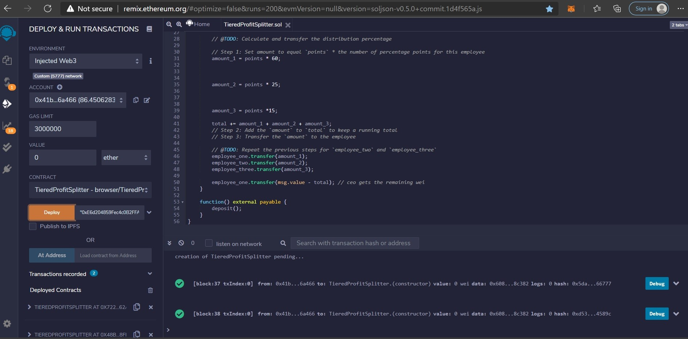
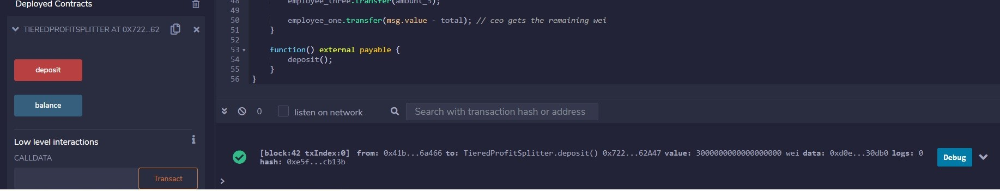

# Unit 20 - "Looks like we've made our First Contract!"

## Background

Your new startup has created its own Ethereum-compatible blockchain to help connect financial institutions, and the team wants to build smart contracts to automate some company finances to make everyone's lives easier, increase transparency, and to make accounting and auditing practically automatic!

Fortunately, you've been learning how to program smart contracts with Solidity! What you will be doing this assignment is creating 3 `ProfitSplitter` contracts. These contracts will do several things:

* Pay your Associate-level employees quickly and easily.

* Distribute profits to different tiers of employees.

* Distribute company shares for employees in a "deferred equity incentive plan" automatically.

## Files

* [`AssociateProfitSplitter.sol`](Starter-Code/AssociateProfitSplitter.sol) -- Level 1 starter code.

* [`TieredProfitSplitter.sol`](Starter-Code/TieredProfitSplitter.sol) -- Level 2 starter code.

* [`DeferredEquityPlan.sol`](Starter-Code/DeferredEquityPlan.sol) -- Level 3 starter code.
